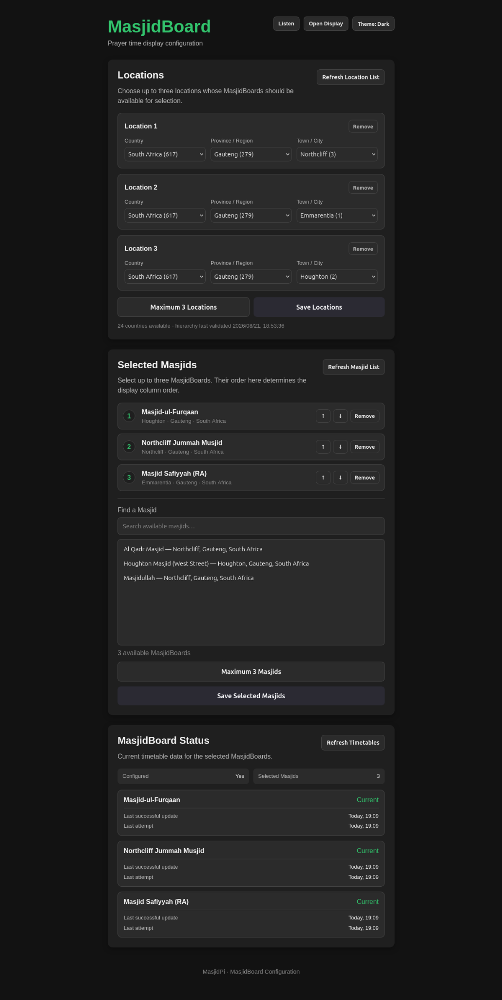
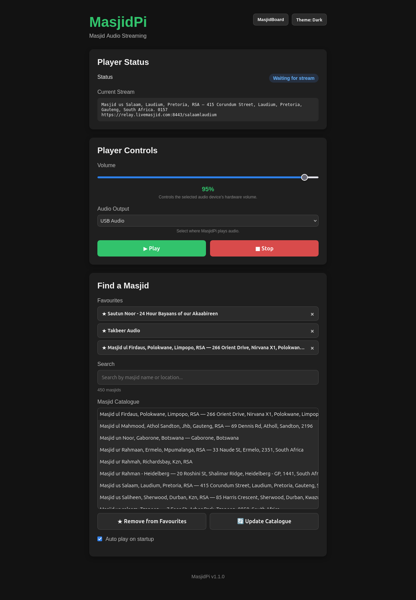

# MasjidPi

MasjidPi is a lightweight home appliance for staying connected to your masjid.

It can be installed with one or both of two independent capabilities:

- **Listen** — live masjid audio streaming, favourites, playback recovery, volume control and audio-device selection.
- **Board** — prayer and Jumu'ah times displayed as a dedicated HDMI MasjidBoard appliance.

The two capabilities share the same MasjidPi core but remain independently operable.

## Features

### Listen

- Browse and search LiveMasjid streams
- Save favourite masājid
- Play and stop streams
- Select the audio output device
- Automatic stream/network reconnection
- Automatic recovery from audio-device interruptions
- Persistent settings and favourites
- Resume playback after reboot

### Board

- Masjid search and selection through MasjidBoard Live
- Prayer and Jumu'ah timetable display
- Up to three selected masjids
- Responsive one-, two- and three-board HDMI layouts
- Next-event countdowns
- Automatic timetable refresh
- Last-known-good cache fallback during upstream outages
- Dedicated Raspberry Pi OS Lite display runtime using Cog/WPE directly on DRM/KMS
- Automatic display startup and recovery through systemd

### Appliance profiles

The installer offers three profiles:

1. Listen
2. Board
3. Listen + Board

Only the dependencies, backend subsystems, APIs, configuration pages and appliance services required by the selected profile are enabled.

## Screenshots

### MasjidBoard HDMI display

The Board profile turns the appliance's HDMI output into a dedicated prayer-time display. The default three-masjid layout shows Adhan/Jamaah times, Friday Jumu'ah information and next-event countdowns.


### MasjidBoard configuration

The configuration interface lets you choose up to three locations and MasjidBoards, order them for the HDMI display, refresh timetable data and see the current cache/update status.



### Listen

Listen provides live masjid audio streaming with favourites, catalogue search, playback controls, volume and audio-output selection.



## Installation

### Recommended — Raspberry Pi / Linux

Install the latest official release with:

```bash
curl -fsSL https://raw.githubusercontent.com/X-Calibre/MasjidPi/main/scripts/install-latest.sh | sudo bash
```

On an interactive terminal, the installer prompts you to choose **Listen**, **Board**, or **Listen + Board**. It detects the supported CPU architecture, verifies the downloaded release, installs the selected appliance profile and validates the running installation before reporting success.

**No Git checkout or Go installation is required.**

For detailed installation information, see the [Installation Guide](docs/INSTALL.md).

### Configuration Web UI

Once installed, open MasjidPi from another device on the same network:

```text
http://<raspberry-pi-ip>:8080
```

For example:

```text
http://192.168.1.50:8080
```

The configuration UI only exposes pages relevant to the installed component profile. The browser does not need to remain open for Listen playback or the Board HDMI display to continue operating.

## Supported Hardware

Official pre-built releases currently support:

- **Linux ARM64 (`aarch64`)**
- **Linux AMD64 (`x86_64`)**

### Raspberry Pi

| Model | Status |
|---|---|
| Raspberry Pi 3B | ✅ v1.1.0 production validated on 64-bit Raspberry Pi OS Lite |
| Raspberry Pi Zero W | ❌ Not supported |

Other Raspberry Pi models have not yet been fully validated.

MasjidPi requires `systemd`. Listen requires an ALSA-compatible audio device. Board requires a supported DRM/KMS display environment and the Cog/WPE packages installed by the production installer.

## How It Works

MasjidPi runs as an appliance service on the host device.

Shared application files are installed under:

```text
/opt/masjidpi
```

Persistent configuration is stored under:

```text
/etc/masjidpi/config.yaml
```

Installed component profile state is stored under:

```text
/etc/masjidpi/components.env
```

Persistent runtime data is stored under:

```text
/var/lib/masjidpi
```

The Web UI runs on port `8080`.

When Board is installed, `masjidpi-display.service` launches Cog directly on DRM/KMS and displays the local MasjidBoard page over HDMI. When Board is not installed, that service is absent.

## Useful Commands

Check the main service:

```bash
sudo systemctl status masjidpi --no-pager
```

Check the Board display service when Board is installed:

```bash
sudo systemctl status masjidpi-display --no-pager
```

View logs:

```bash
sudo journalctl -u masjidpi -f
```

Restart MasjidPi:

```bash
sudo systemctl restart masjidpi
```

Check installed components:

```bash
curl -s http://127.0.0.1:8080/api/components
```

Listen installations can check playback status with:

```bash
curl -s http://127.0.0.1:8080/api/player/status
```

Board installations can check Board status with:

```bash
curl -s http://127.0.0.1:8080/api/masjidboard/status
```

## Development

MasjidPi is written in Go with a web-based configuration frontend.

Run tests:

```bash
make test
```

Source installation is intended for development and testing:

```bash
git clone https://github.com/X-Calibre/MasjidPi.git
cd MasjidPi
sudo ./scripts/install.sh --source
```

See [ROADMAP.md](ROADMAP.md) for the current development roadmap and `docs/MasjidBoard/` for detailed MasjidBoard design and implementation notes.

## Project Status

**Current stable release: v1.1.0**

MasjidBoard and selectable Listen/Board appliance profiles are included in v1.1.0.

v1.1.0 has been production-validated on a Raspberry Pi 3B running 64-bit Raspberry Pi OS Lite using the public one-line release installer. The combined Listen + Board installation, selected audio output and HDMI MasjidBoard display were verified on a clean OS installation.

## Acknowledgements

MasjidPi was inspired by the [eBilal project](https://github.com/Muslims-in-IT/ebilal). We gratefully acknowledge the eBilal contributors and the work they did to make a Raspberry Pi-based masjid audio receiver available as an open-source project.

MasjidPi relies on [LiveMasjid](https://www.livemasjid.com/) for live masjid streams and stream-status data, and on [MasjidBoard Live](https://masjidboardlive.com/) for MasjidBoard timetable data. We gratefully acknowledge the teams maintaining these services.

MasjidPi is an independent project and is not affiliated with or endorsed by eBilal, LiveMasjid or MasjidBoard Live.

## License

MasjidPi is licensed under the GNU Affero General Public License v3.0 (AGPL-3.0).

See [LICENSE](LICENSE) for details.
