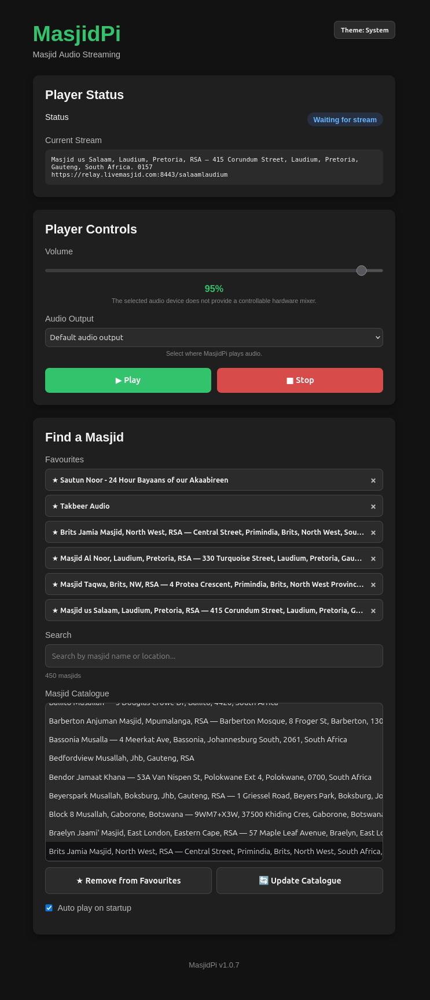

# MasjidPi

MasjidPi is a lightweight internet radio for Raspberry Pi, designed for listening to live masjid streams from around the world.

It provides a simple web interface for finding masājid, selecting streams, managing favourites and controlling playback.



## Features

- Browse and search live masjid streams
- Save favourite masājid
- Play and stop streams
- Select the audio output device
- Automatic stream/network reconnection
- Automatic recovery from audio-device interruptions
- Persistent settings and favourites
- Resume playback after reboot
- Run as a system service
- Update the LiveMasjid catalogue from the Web UI

## Installation

### Recommended — Raspberry Pi / Linux

Install the latest official release with:

```bash
curl -fsSL https://raw.githubusercontent.com/X-Calibre/MasjidPi/main/scripts/install-latest.sh | sudo bash
```

The installer automatically detects the supported CPU architecture, checks the local installation environment, downloads the latest release, verifies its checksum, installs MasjidPi as a system service and validates the running installation before reporting success.

**No Git checkout or Go installation is required.**

For detailed installation information, see the [Installation Guide](docs/INSTALL.md).

### Open the Web UI

Once installed, open MasjidPi from another device on the same network:

```text
http://<raspberry-pi-ip>:8080
```

For example:

```text
http://192.168.1.50:8080
```

The browser is only a remote control. It does not need to remain open for MasjidPi to continue playing or recovering from interruptions.

## Supported Hardware

Official pre-built releases currently support:

- **Linux ARM64 (`aarch64`)**
- **Linux AMD64 (`x86_64`)**

### Raspberry Pi

| Model | Status |
|---|---|
| Raspberry Pi 3B | ✅ Tested |
| Raspberry Pi Zero W | ❌ Not supported |

Other Raspberry Pi models have not yet been fully validated.

MasjidPi requires an ALSA-compatible audio device and `systemd`.

## How It Works

MasjidPi runs entirely on the Raspberry Pi.

The Raspberry Pi stores:

- configuration
- favourites
- selected stream
- playback state
- the local masjid catalogue

Your phone, tablet or computer simply connects to the Web UI.

This means multiple devices can control the same MasjidPi installation without each device maintaining its own settings.

## Configuration

Persistent configuration is stored in:

```text
/etc/masjidpi/config.yaml
```

The active masjid catalogue is stored in:

```text
/var/lib/masjidpi/catalogue.json
```

Application files are installed under:

```text
/opt/masjidpi
```

The Web UI runs on port `8080`.

The **Update Catalogue** button in the Web UI downloads the latest LiveMasjid catalogue and updates the active catalogue automatically.

## Useful Commands

Check the service:

```bash
sudo systemctl status masjidpi --no-pager
```

View logs:

```bash
sudo journalctl -u masjidpi -f
```

Restart MasjidPi:

```bash
sudo systemctl restart masjidpi
```

Check playback status:

```bash
curl -s http://127.0.0.1:8080/api/player/status
```

## Development

MasjidPi is written in Go with a web-based frontend.

Run from the source tree:

```bash
make run
```

Run tests:

```bash
make test
```

Source installation is intended for development and testing:

```bash
git clone https://github.com/X-Calibre/MasjidPi.git
cd MasjidPi
sudo ./scripts/install.sh --source
```

See [ROADMAP.md](ROADMAP.md) for the current development roadmap.

## Project Status

**Current stable release: v1.0.7**

MasjidPi is actively developed and has been validated on a Raspberry Pi 3B running 64-bit ARM64 Linux.

## Acknowledgements

MasjidPi was inspired by the [eBilal project](https://github.com/Muslims-in-IT/ebilal). We gratefully acknowledge the eBilal contributors and the work they did to make a Raspberry Pi-based masjid audio receiver available as an open-source project.

MasjidPi relies on [LiveMasjid](https://www.livemasjid.com/) for the live masjid streams and the related stream and status data that make the service possible. We gratefully acknowledge the LiveMasjid team for providing and maintaining this service.

MasjidPi is an independent project and is not affiliated with or endorsed by eBilal or LiveMasjid.

## License

MasjidPi is licensed under the GNU Affero General Public License v3.0 (AGPL-3.0).

See [LICENSE](LICENSE) for details.
