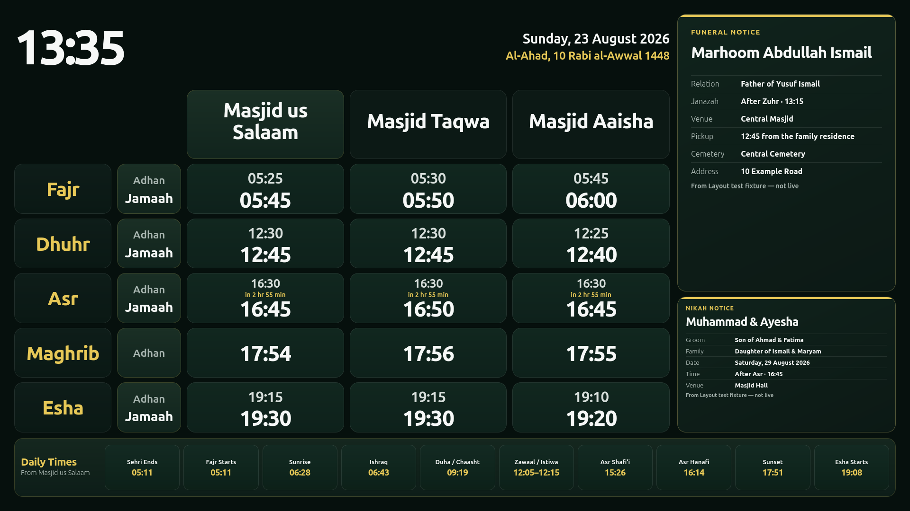
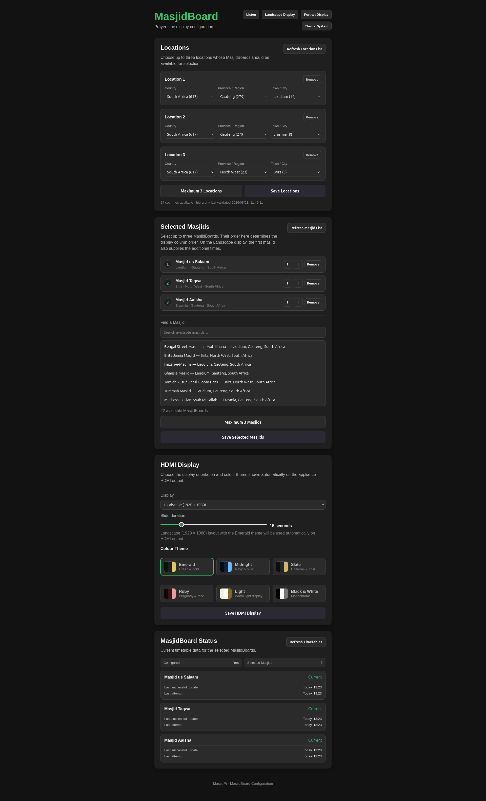
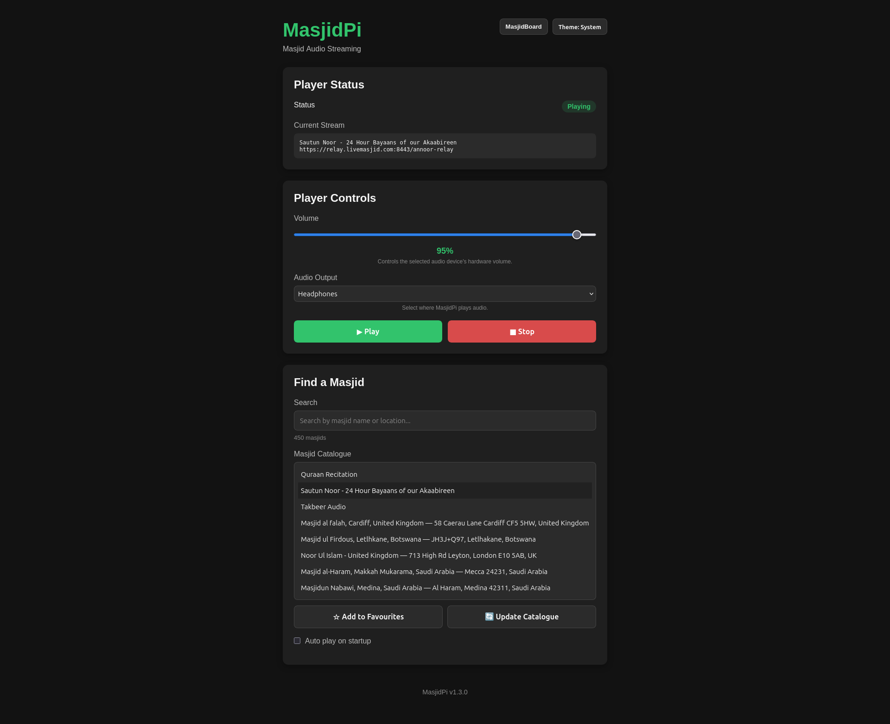

# MasjidPi

MasjidPi is a lightweight home appliance for staying connected to your masjid.

It can be installed with one or both of two independent capabilities:

- **Listen** — live masjid audio streaming, favourites, playback recovery, volume control and audio-device selection.
- **Board** — prayer and Jumu'ah times displayed as a dedicated HDMI MasjidBoard appliance.

The two capabilities share the same MasjidPi core but remain independently operable.

## Features

### Listen

- Browse and search LiveMasjid streams
- Save favourite masājid
- Play and stop streams
- Select the audio output device
- Automatic stream/network reconnection
- Automatic recovery from audio-device interruptions
- Persistent settings and favourites
- Resume playback after reboot

### Board

- Masjid search and selection through MasjidBoard Live
- Prayer and Jumu'ah timetable display
- Up to three selected masjids
- Responsive one-, two- and three-board HDMI layouts
- **Landscape (1920 × 1080)** and **Portrait (600 × 1024)** user-selectable HDMI layouts
- Landscape timetable with shared Adhan/Jamaah headings and a full-width Daily Times footer
- Rotating, source-labelled community cards for announcements, Nikah, funerals, Eid, Salaah changes, well-wishes, Taleem, Dawah/Gasht, three-day Jamaat, contributions and calculated new-moon information when supplied by MasjidBoard Live
- Gregorian date plus masjid-adjusted Islamic date with Islamic weekday transliteration
- Islamic-date rollover aligned to MasjidBoard Live sunset/date-adjustment behaviour
- Six curated colour themes: **Emerald, Midnight, Slate, Ruby, Light, and Black & White**
- Live theme and orientation changes from the Web UI without restarting the display service
- Next-event countdowns
- Automatic timetable refresh
- Last-known-good cache fallback during upstream outages
- Dedicated Raspberry Pi OS Lite display runtime using Cog/WPE directly on DRM/KMS
- Automatic display startup and recovery through systemd
- Raspberry Pi 3B and Pi 4 appliance validation, including 1080p HDMI operation

### Appliance profiles

The installer offers three profiles:

1. Listen
2. Board
3. Listen + Board

Only the dependencies, backend subsystems, APIs, configuration pages and appliance services required by the selected profile are enabled.

## Screenshots

### MasjidBoard HDMI display

The Board profile turns the appliance's HDMI output into a dedicated prayer-time display. Users can select Landscape or Portrait presentation. Landscape combines up to three masjid columns, Gregorian/Islamic dates, Friday Jumu'ah information, next-event countdowns, Daily Times and rotating community cards when supplied upstream. Board colour themes are also user-selectable from the Web UI.



### MasjidBoard configuration

The configuration interface lets you choose up to three locations and MasjidBoards, order them for the HDMI display, select the HDMI layout and colour theme, refresh timetable data and see the current cache/update status.



### Listen

Listen provides live masjid audio streaming with favourites, catalogue search, playback controls, volume and audio-output selection.



## Installation

### Recommended — Raspberry Pi / Linux

Install the latest official release with:

```bash
curl -fsSL https://raw.githubusercontent.com/X-Calibre/MasjidPi/main/scripts/install-latest.sh | sudo bash
```

On an interactive terminal, the installer prompts you to choose **Listen**, **Board**, or **Listen + Board**. It detects the supported CPU architecture, verifies the downloaded release, installs the selected appliance profile and validates the running installation before reporting success.

**No Git checkout or Go installation is required.**

For detailed installation information, see the [Installation Guide](docs/INSTALL.md).

### Configuration Web UI

Once installed, open MasjidPi from another device on the same network:

```text
http://<raspberry-pi-ip>:8080
```

For example:

```text
http://192.168.1.50:8080
```

The configuration UI only exposes pages relevant to the installed component profile. The browser does not need to remain open for Listen playback or the Board HDMI display to continue operating.

## Supported Hardware

Official pre-built releases currently support:

- **Linux ARM64 (`aarch64`)**
- **Linux AMD64 (`x86_64`)**

### Raspberry Pi

The Raspberry Pi 3B and Raspberry Pi 4 are production-validated Raspberry Pi platforms. Other models in the table below are performance expectations based on their CPU architecture, memory and the measured appliance workloads; they should not be treated as production-validated until tested on real hardware.

| Raspberry Pi product | Listen | Listen + Board | Status / expectation |
|---|---|---|---|
| Raspberry Pi Zero W | ❌ | ❌ | Not supported. ARMv6 platform; runtime compatibility problems have been confirmed during testing. |
| Raspberry Pi 1 family | ❌ | ❌ | Not supported. ARMv6 platform in the same compatibility class as the Zero W. |
| Raspberry Pi 2 Model B v1.1 | 🟡 | 🟡 | Likely capable, but older 32-bit Cortex-A7 hardware and not a priority support target. |
| Raspberry Pi 2 Model B v1.2 | 🟢 expected | 🟡/🟢 expected | Pi 3-class Cortex-A53 architecture at a lower clock speed; expected to be usable but not validated. |
| Raspberry Pi Zero 2 W | 🟢 expected | 🟡/🟢 expected | Strong Listen candidate. Quad-core Cortex-A53 CPU should be sufficient; 512 MB RAM is the main constraint for the full Board display stack. |
| Raspberry Pi 3A+ | 🟢 expected | 🟡/🟢 expected | Faster Cortex-A53 CPU than the validated Pi 3B, but only 512 MB RAM. Full appliance use should be validated for memory headroom. |
| **Raspberry Pi 3B** | **✅ validated** | **✅ validated** | Current reference platform. Comfortable CPU, RAM and thermal headroom on 64-bit Raspberry Pi OS Lite. |
| Raspberry Pi 3B+ | 🟢 expected | 🟢 expected | Same 1 GB memory class as the Pi 3B with a faster Cortex-A53 CPU; expected to perform at least as well as the reference platform. |
| **Raspberry Pi 4 family** | **✅ validated** | **✅ validated** | Validated on a 4 GB Pi 4 with 64-bit Raspberry Pi OS Lite, native 1080p HDMI, simultaneous audio playback and the GLES-backed Board runtime. |
| Raspberry Pi 5 family | 🟢 expected | 🟢 expected | Far more CPU performance than MasjidPi currently requires. |
| Compute Module 3 / 3+ | 🟢 expected | 🟢 expected | Pi 3-class platform; suitability depends on the carrier, RAM variant and required audio/display hardware. |
| Compute Module 4 | 🟢 expected | 🟢 expected | Pi 4-class performance with ample headroom; suitable for embedded appliance designs. |
| Compute Module 5 | 🟢 expected | 🟢 expected | Pi 5-class performance; substantially more performance than currently required. |

**Legend:** ✅ production validated · 🟢 expected to run well · 🟡 expected to be usable but with limitations or additional validation required · ❌ not supported.

#### Raspberry Pi 3B performance baseline

A production-style **Listen + Board** installation was measured on a Raspberry Pi 3B running 64-bit Debian 13 / Raspberry Pi OS Lite-class software with four Cortex-A53 cores at up to 1.2 GHz and approximately 905 MiB usable RAM.

With Listen actively running alongside the Cog/WPE MasjidBoard display:

- approximately **337 MiB RAM used** and **567 MiB available**
- **no swap usage** after a fresh boot
- MasjidPi backend approximately **15 MiB RSS** and about **2% CPU**
- `mpv` approximately **75–80 MiB RSS** and about **7% CPU**
- WPE web renderer approximately **190–195 MiB RSS** and about **31% CPU** during the sample
- CPU temperature approximately **58–60 °C**
- `vcgencmd get_throttled` remained **`0x0`**, with no thermal or undervoltage throttling recorded

With the Board display service stopped and Listen left running, system memory use fell to approximately **195 MiB**, with about **709 MiB available** and no swap use. The measured system-level overhead of enabling the Board display stack was therefore roughly **140–150 MiB** in this test.

These results indicate that the Pi 3B has substantial headroom for the complete MasjidPi appliance. They also suggest that 512 MB Cortex-A53 devices such as the Pi Zero 2 W and Pi 3A+ are strong candidates: Listen should fit comfortably, while Listen + Board appears viable but still requires real-device and long-duration validation because of the reduced memory headroom.

Long-duration soak testing and validation across additional Raspberry Pi models are still planned. Performance expectations above may be revised as hardware testing expands.

MasjidPi requires `systemd`. Listen requires an ALSA-compatible audio device. Board requires a supported DRM/KMS display environment and the Cog/WPE packages installed by the production installer.

## How It Works

MasjidPi runs as an appliance service on the host device.

Shared application files are installed under:

```text
/opt/masjidpi
```

Persistent configuration is stored under:

```text
/etc/masjidpi/config.yaml
```

Installed component profile state is stored under:

```text
/etc/masjidpi/components.env
```

Persistent runtime data is stored under:

```text
/var/lib/masjidpi
```

The Web UI runs on port `8080`.

When Board is installed, `masjidpi-display.service` launches Cog directly on DRM/KMS with its GLES renderer and displays the local MasjidBoard page over HDMI. When Board is not installed, that service is absent. Saved Board layout/theme preferences are read by the display page itself so user changes can appear on HDMI without shell access or a service restart.

## Useful Commands

Check the main service:

```bash
sudo systemctl status masjidpi --no-pager
```

Check the Board display service when Board is installed:

```bash
sudo systemctl status masjidpi-display --no-pager
```

View logs:

```bash
sudo journalctl -u masjidpi -f
```

Restart MasjidPi:

```bash
sudo systemctl restart masjidpi
```

Check installed components:

```bash
curl -s http://127.0.0.1:8080/api/components
```

Listen installations can check playback status with:

```bash
curl -s http://127.0.0.1:8080/api/player/status
```

Board installations can check Board status with:

```bash
curl -s http://127.0.0.1:8080/api/masjidboard/status
```

Board installations can check the saved HDMI presentation settings with:

```bash
curl -s http://127.0.0.1:8080/api/masjidboard/layout
```

## Development

MasjidPi is written in Go with a web-based configuration frontend.

Run tests:

```bash
make test
```

Source installation is intended for development and testing:

```bash
git clone https://github.com/X-Calibre/MasjidPi.git
cd MasjidPi
sudo ./scripts/install.sh --source
```

See [ROADMAP.md](ROADMAP.md) for the current development roadmap and `docs/MasjidBoard/` for detailed MasjidBoard design and implementation notes.

## Project Status

**Current stable release: v1.4.0**

v1.4.0 unifies the Listener and MasjidBoard configuration experience with shared top-level navigation, a consolidated Now Playing view, dedicated Masjids, Display and Status tabs, layout-aware display previews and consistent version information. It also includes the latest Portrait and Landscape display refinements, clearer primary-masjid behaviour and reduced Listener status polling.

The combined Listen + Board source build was installed and validated on Debian 13 in the MasjidPi Proxmox LXC. Both component APIs and configuration pages responded successfully, the existing three-masjid configuration was preserved, and the integrated WebUI and display configuration were reviewed before release.

## Acknowledgements

MasjidPi was inspired by the [eBilal project](https://github.com/Muslims-in-IT/ebilal). We gratefully acknowledge the eBilal contributors and the work they did to make a Raspberry Pi-based masjid audio receiver available as an open-source project.

MasjidPi relies on [LiveMasjid](https://www.livemasjid.com/) for live masjid streams and stream-status data, and on [MasjidBoard Live](https://masjidboardlive.com/) for MasjidBoard timetable data. We gratefully acknowledge the teams maintaining these services.

MasjidPi is an independent project and is not affiliated with or endorsed by eBilal, LiveMasjid or MasjidBoard Live.

## License

MasjidPi is licensed under the GNU Affero General Public License v3.0 (AGPL-3.0).

See [LICENSE](LICENSE) for details.
