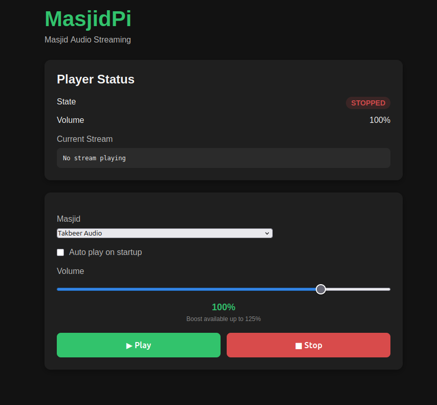

# MasjidPi

MasjidPi is an open-source internet radio designed specifically for listening to live audio streams from masājid around the world.

The project is intentionally lightweight and designed to run on low-powered Raspberry Pi hardware while providing a simple web interface for selecting and controlling mosque audio streams.

---

## Screenshot



---

# About this Project

MasjidPi has a unique story.

It is being developed by someone with **no prior software development experience**. Every line of code has been written through an iterative collaboration with AI, while the project vision, feature decisions, testing, and overall direction remain human-driven.

Rather than asking AI to generate an application in one step, every feature is designed, implemented, tested, refined and documented through many small iterations.

The goal is not only to build a useful piece of software, but also to demonstrate that modern AI tools can empower people without formal programming backgrounds to create high-quality open-source software through curiosity, persistence and careful testing.

If this project inspires someone else to begin learning software development, then it has already been a success.

---

# Vision

A Raspberry Pi connected to speakers that allows users to:

- Browse live masjid streams
- Listen to live broadcasts
- Save favourite masājid
- Automatically reconnect after network outages
- Resume playback after power loss
- Be managed entirely through a web browser

MasjidPi is designed to run comfortably on hardware as small as the Raspberry Pi Zero while remaining extensible for future features.

---

# Project Philosophy

MasjidPi follows a few simple principles.

- Keep the software lightweight.
- Prioritise reliability over complexity.
- Design for Raspberry Pi first.
- Build features only when they solve a real problem.
- Prefer simple, maintainable code over clever code.
- Keep the application fully self-contained whenever practical.
- Minimise external dependencies.
- Build incrementally and test every feature.

---

# Current Features

- Responsive web-based player interface
- Live playback status
- Volume control (0–125%)
- MPV-based audio playback
- Local stream catalogue
- Automatic catalogue generation from LiveMasjid
- Preserve LiveMasjid stream ordering
- Generate relay URLs automatically
- Play streams by catalogue selection
- Remember the last selected stream
- Optional automatic playback on startup
- Runtime catalogue updates without restarting
- Installable as a Linux systemd service
- Automatic startup on boot
- Installer self-test

---

# Planned Features

- Automatic application updates
- Searchable stream catalogue
- Favourite masājid
- Graceful handling of offline streams
- OLED display support
- Push-button controls
- Audio equaliser
- Multi-language interface
- Read-only Raspberry Pi mode

---

# Requirements

Currently MasjidPi supports:

- Linux
- Go 1.26 or newer
- MPV
- Git

Supported hardware currently includes:

- Raspberry Pi Zero
- Raspberry Pi Zero 2 W
- Raspberry Pi 3
- Raspberry Pi 4
- Raspberry Pi 5
- Standard Linux PCs (development)

---

# Installation

Clone the repository:

```bash
git clone https://github.com/X-Calibre/MasjidPi.git
cd MasjidPi
```

Run the installer:

```bash
sudo ./scripts/install.sh
```

The installer automatically:

- Detects your operating system
- Installs missing dependencies
- Installs Go (if required)
- Builds MasjidPi
- Installs the runtime
- Installs the systemd service
- Enables automatic startup
- Performs a self-test to verify the installation

---

# Runtime Layout

MasjidPi installs into:

```
/opt/masjidpi
├── bin
│   └── masjidpi
├── configs
│   └── default.yaml
├── data
│   └── catalogue.json
└── frontend
    ├── index.html
    ├── app.js
    └── style.css
```

The application runs as a Linux systemd service and automatically starts during boot.

---

# Development

To run directly from the source tree:

```bash
make run
```

or

```bash
cd backend
go run ./cmd/masjidpi
```

---

# Web Interface

After installation, open your browser and navigate to:

```
http://localhost:8080
```

If MasjidPi is running on another computer or Raspberry Pi, replace `localhost` with the IP address of that machine.

---

# Updating the Catalogue

MasjidPi downloads and parses the latest stream catalogue from LiveMasjid.

The catalogue can currently be updated from the web interface using the **Update Catalogue** button.

Future releases will include scheduled automatic updates.

---

# Development Status

MasjidPi is currently in active development.

The following components are complete:

- Core player
- Stream catalogue
- Catalogue updater
- Installer
- Runtime environment
- Systemd integration

Current development is focused on:

- Automatic application updates
- Playback reliability
- Search
- Favourites
- Raspberry Pi optimisation

Breaking changes may still occur before version 1.0.

---

# Contributing

Bug reports, feature requests and pull requests are welcome.

Please see:

- CONTRIBUTING.md

---

# License

MasjidPi is licensed under the GNU Affero General Public License v3.0 (AGPL-3.0).

See the LICENSE file for details.