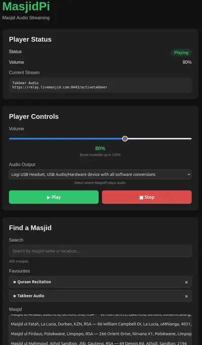

# MasjidPi

MasjidPi is a lightweight internet radio for Raspberry Pi, designed for listening to live masjid streams from around the world.

It provides a simple web interface for finding masājid, selecting streams, managing favourites and controlling playback.



## Features

- Browse and search live masjid streams
- Update the LiveMasjid stream catalogue from the Web UI
- Save favourite masājid
- Play and stop streams
- Select an audio output device
- Automatically recover when an audio device is disconnected
- Automatically reconnect when a stream or network connection is interrupted
- Remember the last selected stream
- Resume playback automatically after a reboot
- Persistent settings shared across phones, tablets and computers
- Runs as a system service and starts automatically with the Raspberry Pi

## How it works

MasjidPi runs entirely on the Raspberry Pi.

The Raspberry Pi stores the application's settings, favourites and playback state. The web browser is simply a remote control.

This means you can open MasjidPi from your laptop, phone or tablet and see the same settings and favourites.

The Web UI does not need to remain open for playback or automatic recovery to work.

## Requirements

MasjidPi is designed for Linux and Raspberry Pi.

### Supported operating systems

The installer currently supports:

- Debian
- Raspberry Pi OS / Raspbian
- Ubuntu
- Linux Mint

The system must have an ALSA-compatible audio device and `systemd`.

### Supported release architectures

Official pre-built releases are provided for:

- **Linux ARM64 (`aarch64`)** — recommended for 64-bit Raspberry Pi OS on Raspberry Pi 3B and newer
- **Linux AMD64 (`x86_64`)** — suitable for standard 64-bit Intel/AMD Linux systems

The official release packages are **ARM64 and AMD64 only**. ARMv7/ARMv6 release packages are not provided.

### Raspberry Pi testing

The following Raspberry Pi models have been tested:

- **Raspberry Pi 3B — works**
- **Raspberry Pi Zero W — not supported**

The Raspberry Pi Zero W has been tested and MasjidPi does not run reliably on that hardware. Do not use a Pi Zero W for a MasjidPi installation.

Other Raspberry Pi models and variants have not yet been fully tested and should not currently be considered officially supported.

## Installation

### Recommended: install the latest release

For normal users, the recommended installation method is to use the **pre-built release package**. You do not need Git, Go or the MasjidPi source repository.

Download the latest ARM64 or AMD64 release archive from the [MasjidPi GitHub Releases page](https://github.com/X-Calibre/MasjidPi/releases), then extract it.

For example, on an ARM64 Raspberry Pi:

```bash
cd /tmp
tar -xzf masjidpi-vX.Y.Z-linux-arm64.tar.gz
cd masjidpi-vX.Y.Z-linux-arm64
sudo ./scripts/install.sh
```

The release package contains the MasjidPi executable, default configuration, catalogue, Web UI and complete installer. The installer automatically detects the operating system and architecture, installs the required runtime dependencies, installs MasjidPi and its systemd service, starts the service and runs a self-test.

You **do not need to install Go manually or build MasjidPi yourself** when installing an official release.

The installer will:

1. Detect the operating system and CPU architecture.
2. Install required runtime packages including MPV, FFmpeg and ALSA utilities.
3. Download and verify the latest release when running the repository installer, or use the bundled release when running from a release package.
4. Install the MasjidPi executable under `/opt/masjidpi`.
5. Install the configuration under `/etc/masjidpi`.
6. Install the stream catalogue under `/var/lib/masjidpi` on a fresh installation.
7. Install the Web UI.
8. Create and enable the `masjidpi.service` systemd service.
9. Start the service.
10. Run the MasjidPi self-test.

Existing configuration and persistent runtime data are preserved during upgrades.

### Open the Web UI

From another computer, phone or tablet on the same network, open:

```text
http://<raspberry-pi-ip>:8080
```

For example:

```text
http://192.168.1.50:8080
```

The Web UI is a remote control. It does not need to remain open for MasjidPi to continue playing audio or recovering from stream/network interruptions.

## Configuration

The persistent configuration is stored at:

```text
/etc/masjidpi/config.yaml
```

The active stream catalogue is stored at:

```text
/var/lib/masjidpi/catalogue.json
```

Application files are installed under:

```text
/opt/masjidpi
```

The Web UI is available from the same MasjidPi service on port `8080`.

Configuration changes made through the Web UI are persistent and are shared across clients using the same MasjidPi installation.

### Updating the LiveMasjid catalogue

The Web UI includes an **Update Catalogue** button. The catalogue updater downloads the latest LiveMasjid data and writes the generated catalogue to the active runtime location:

```text
/var/lib/masjidpi/catalogue.json
```

The Web UI reloads the updated catalogue after a successful update. The updater does not use the legacy relative `data/` catalogue path for an installed deployment.

## Updating MasjidPi

For an installed release, download the new release archive for your architecture, extract it and run the bundled installer:

```bash
cd /tmp
tar -xzf masjidpi-vX.Y.Z-linux-arm64.tar.gz
cd masjidpi-vX.Y.Z-linux-arm64
sudo ./scripts/install.sh
```

Replace `arm64` with `amd64` when installing on a 64-bit x86 Linux system.

The installer detects the existing installation and updates it in place. It replaces the application binary and Web UI while preserving `/etc/masjidpi` and `/var/lib/masjidpi`.

The release installer verifies the downloaded release archive using the accompanying `SHA256SUMS` file before installation. You can also verify an archive manually:

```bash
sha256sum -c <(grep 'masjidpi-vX.Y.Z-linux-arm64.tar.gz' SHA256SUMS)
```

The result should be:

```text
masjidpi-vX.Y.Z-linux-arm64.tar.gz: OK
```

### Installing from source

Source installation is intended for development and testing rather than normal users.

Clone the repository and run the installer with `--source`:

```bash
git clone https://github.com/X-Calibre/MasjidPi.git
cd MasjidPi
sudo ./scripts/install.sh --source
```

Source installation builds MasjidPi locally using Go. It is useful when testing unreleased changes or developing MasjidPi.

## Release packages

Each release includes pre-built archives for the supported architectures:

```text
masjidpi-vX.Y.Z-linux-arm64.tar.gz
masjidpi-vX.Y.Z-linux-amd64.tar.gz
```

A `SHA256SUMS` file is provided with each release.

Release archives contain:

- MasjidPi executable
- Default configuration
- Initial stream catalogue
- Web UI
- Version information
- Complete installer scripts

## Useful Commands

Check the service:

```bash
sudo systemctl status masjidpi --no-pager
```

View the logs:

```bash
sudo journalctl -u masjidpi -f
```

Restart MasjidPi:

```bash
sudo systemctl restart masjidpi
```

Stop MasjidPi:

```bash
sudo systemctl stop masjidpi
```

Check playback status:

```bash
curl -s http://127.0.0.1:8080/api/player/status
```

## Development

Run MasjidPi directly from the source tree:

```bash
make run
```

Run the tests:

```bash
make test
```

## Project Status

MasjidPi is currently in active development.

**Current stable release: v1.0.5**

v1.0.5 is the current stable release and has been validated on a Raspberry Pi 3B running a 64-bit ARM64 Linux environment. Validation includes installation as a systemd service, MPV playback, the Web UI, persistent configuration, live masjid stream playback and successful LiveMasjid catalogue updates using the installed `/var/lib/masjidpi` runtime path.

The next release will introduce the release-first installer workflow, allowing normal users to install MasjidPi from a pre-built release without cloning the source repository or installing Go. Source installation remains available for developers with `--source`.

See [ROADMAP.md](ROADMAP.md) for the development roadmap.

## Acknowledgements

MasjidPi was inspired by the [eBilal project](https://github.com/Muslims-in-IT/ebilal). We gratefully acknowledge the eBilal contributors and the work they did to make a Raspberry Pi-based masjid audio receiver available as an open-source project.

MasjidPi relies on [LiveMasjid](https://www.livemasjid.com/) for the live masjid streams and the related stream and status data that make the service possible. We gratefully acknowledge the LiveMasjid team for providing and maintaining this service.

MasjidPi is an independent project and is not affiliated with or endorsed by eBilal or LiveMasjid.

## License

MasjidPi is licensed under the GNU Affero General Public License v3.0 (AGPL-3.0).

See [LICENSE](LICENSE) for details.
