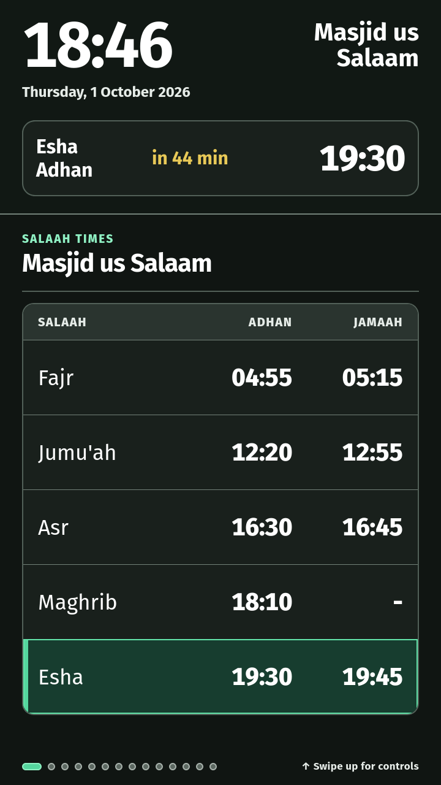
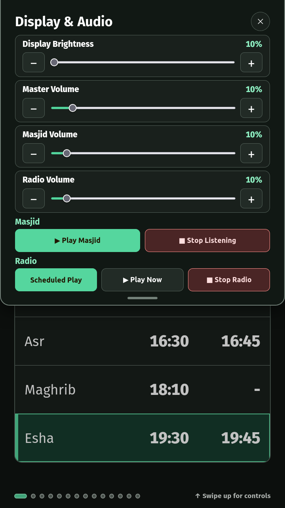
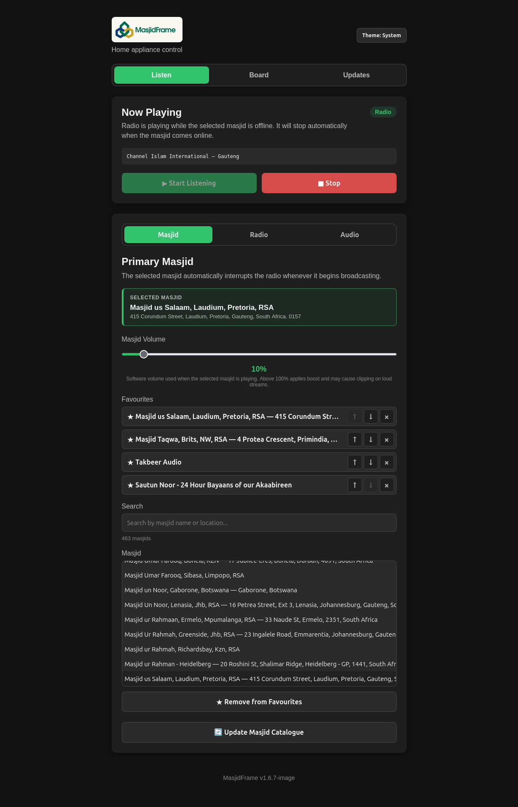

# MasjidFrame

MasjidFrame is a lightweight home appliance for live masjid audio and prayer times and Islamic content. The portrait touchscreen appliance combines everyday touch controls with a Web UI for configuration from a phone or computer.

It can run either capability independently or install both together:

- **Listen** prioritises a selected LiveMasjid stream and can play Islamic Radio while the masjid is offline.
- **Board** displays prayer times, Jumu'ah schedules and supported community content from MasjidBoard Live on the 720 × 1280 portrait Raspberry Pi Touch Display 2 or a landscape TV/monitor.

> New to MasjidFrame? Start with the [User Guide](docs/USER_GUIDE.md).

## Features

### Listen

- Search LiveMasjid streams and save favourites
- Give the selected masjid immediate priority over Radio
- Resume Radio after a configurable delay or within a daily schedule
- Use scheduled, immediate or stopped Radio modes
- Set independent Masjid and Radio volumes
- Select an ALSA audio output and recover from device interruptions
- Automatically select MasjidFrame Built-In Audio on first run when the supported built-in USB audio device is detected
- Restore saved settings and unattended playback after reboot

### Board

- Complete first-run setup on the attached touchscreen, including visible or hidden Wi-Fi networks
- Choose the initial location, time zone, and MasjidBoard without another computer
- Defer Board setup when the catalogue is unavailable and resume from Set up MasjidBoard
- Select and order up to three MasjidBoard Live masjids
- Use a responsive landscape TV/Monitor layout or the 720 × 1280 portrait Raspberry Pi Touch Display 2
- Show prayer times, next-event countdowns, Daily Times and detailed Friday Jumu'ah schedules
- Show supported announcements, programmes, funeral, Nikah, Eid, contribution and other community cards
- Show optional Daily Ayah, Hadith, Sunnah, Islamic Economic Indicators and Dua after Adhan
- Highlight the published Zawaal/Istiwaa interval
- Continue with last-known-good timetable data during temporary upstream outages
- Use ten colour themes, a top Quick Settings sheet and a bottom control sheet with Masjid, Radio, Theme, Network and Updates tabs
- Check enabled Daily Ayah, Hadith and Sunnah content with the normal notice refresh, usually every 30 minutes

Content availability depends on what each upstream masjid publishes.

### Appliance updates

- Check for signed stable releases automatically, normally once a week, or use Check now
- Approve or postpone offered updates from the touchscreen or Web UI
- Install approved updates in the normal overnight window, with audio and Adhan protection
- On supported A/B appliance images, verify the new system after reboot and roll back automatically if the trial fails

See the [User Guide](docs/USER_GUIDE.md#update-the-appliance) for update timing and approval behaviour.

## Screenshots

Current v1.6.7 interface. Portrait images are 720 × 1280 appliance browser previews.

| Portrait Board preview | Quick Settings preview |
|---|---|
|  |  |



See the [illustrated User Guide](docs/USER_GUIDE.md) for setup, touch controls, Board configuration, Radio scheduling, audio output and updates.

## Install

MasjidFrame supports 64-bit ARM Linux and 64-bit x86 Linux. Raspberry Pi 3B and Raspberry Pi 4 are the production-validated appliance platforms.

For the Raspberry Pi 3 A/B appliance, the [v1.6.7 release](https://github.com/X-Calibre/MasjidPi/releases/tag/v1.6.7) includes a full SD-card image, a signed update bundle and checksums. Existing A/B appliances can use the touchscreen or Web UI Updates controls.

For installation on an existing supported Linux system, install the latest stable application release:

```bash
curl -fsSL https://raw.githubusercontent.com/X-Calibre/MasjidPi/main/scripts/install-latest.sh | sudo bash
```

The installer prompts for one of three profiles:

1. Listen
2. Board
3. Listen + Board

After installation, open the configuration interface from another device on the same network:

```text
http://<masjidframe-ip-address>:8080
```

See the [Installation Guide](docs/INSTALL.md) for supported systems, installer behavior, updates and troubleshooting. Hardware compatibility and measured Raspberry Pi performance are documented in the [Hardware Guide](docs/HARDWARE.md).

## Documentation

- [User Guide](docs/USER_GUIDE.md) — illustrated appliance setup, touch controls, Listen, Radio, Board, updates and troubleshooting
- [Installation Guide](docs/INSTALL.md) — installation, updates and component profiles
- [Hardware Guide](docs/HARDWARE.md) — supported platforms and measured performance
- [Roadmap](ROADMAP.md) — current priorities and future work
- [MasjidBoard technical documentation](docs/MasjidBoard/README.md)
- [SD-card write policy](docs/SD_CARD_WRITE_POLICY.md)

## Development

MasjidFrame uses a Go backend and a browser-based frontend.

Run the automated tests:

```bash
make test
```

For source-based development installation:

```bash
git clone https://github.com/X-Calibre/MasjidPi.git MasjidFrame
cd MasjidFrame
sudo ./scripts/install.sh --source
```

Contributions are described in [CONTRIBUTING.md](CONTRIBUTING.md).

## Release

**Current stable release: v1.6.7**

v1.6.7 improves MasjidBoard Live discovery when a provider response contains blank city buckets. Release assets include Linux ARM64 and AMD64 application packages, a Raspberry Pi 3 A/B image and a signed Raspberry Pi 3 update bundle.

Download assets and read the changelog on [GitHub Releases](https://github.com/X-Calibre/MasjidPi/releases/tag/v1.6.7).

## Data sources and acknowledgements

MasjidFrame was inspired by the [eBilal project](https://github.com/Muslims-in-IT/ebilal).

MasjidFrame uses [LiveMasjid](https://www.livemasjid.com/) for live masjid streams, [MasjidBoard Live](https://masjidboardlive.com/) for timetable and community data, and [Jamiatul Ulama South Africa](https://www.jamiatsa.org/category/islamic-economic-indicators/) for optional Islamic Economic Indicators.

MasjidFrame is independent and is not affiliated with or endorsed by those projects or services.

## Licence

MasjidFrame is licensed under the [GNU Affero General Public License v3.0](LICENSE).
