# MasjidPi User Guide

This guide explains day-to-day use of MasjidPi. It is intended for people using MasjidPi as a home appliance rather than for developers.

For installation instructions, see [INSTALL.md](INSTALL.md).

## 1. MasjidPi at a glance

MasjidPi can be installed with one or both of these capabilities:

- **Listen** — plays your selected masjid's live audio and can optionally play an Islamic radio station while the masjid is offline.
- **Board** — displays prayer times and other supported masjid information on a connected HDMI display.
- **Listen + Board** — runs both capabilities on the same device.

Open the MasjidPi Web UI from another device on the same network:

```text
http://<masjidpi-ip-address>:8080
```

The browser does not need to remain open. MasjidPi continues operating as an appliance after you close the Web UI.

The Web UI shows a **Listen** tab, a **Board** tab, or both, according to the components installed on the appliance. The **Theme** button changes only the Web UI between System, Light and Dark appearance. Board display themes are configured separately in Board settings.

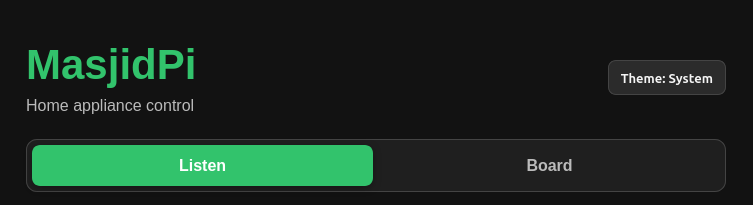

## First-run MasjidFrame setup

When a new portrait Board appliance has no saved Wi-Fi profile, its touchscreen opens the setup wizard automatically.

1. Select a detected 2.4 GHz Wi-Fi network, or choose **Add hidden network** and enter its exact SSID.
2. Use the built-in keyboard to enter the password. The normal keyboard includes a number row; select **#+=** for additional symbols.
3. For a hidden network, choose whether it is password protected or open before connecting.
4. After connection, note the displayed IP address and any network-issued FQDN.
5. Choose the country, province/region and town/city, then select the initial masjid.
6. Select **Start MasjidFrame** to open the Board.

The completion screen directs you to the full Web UI from a phone, tablet or computer on the same Wi-Fi. Use the displayed address to configure Listen, audio, additional masjids and Board preferences. An FQDN is shown only when the local network supplies or resolves one; MasjidFrame does not assume that a `.local` address exists.

After setup, normal boots open the configured Board directly.

To change Wi-Fi later, swipe up on the Appliance Display, open the **Network** tab and select **Change Wi-Fi network**. The same visible/hidden-network setup screen opens with a **Back to board** action. Merely opening or leaving this screen does not alter the current connection; a network change occurs only after a new connection succeeds.

## 2. Listen: how audio priority works

Listen has two possible audio sources:

1. **Masjid** — the primary source.
2. **Radio** — an optional secondary source.

The selected masjid always has priority. If Radio is playing and the selected masjid comes online, MasjidPi stops Radio and switches to the masjid immediately.

When the masjid goes offline again, Radio can resume according to the configured Radio operating mode, daily schedule and resume delay.

This priority cannot be reversed: Radio never interrupts a live masjid broadcast.

## 3. Understanding Now Playing

The **Now Playing** section shows the current Listen state and active stream.

Typical states include:

- **Masjid** — the selected masjid is currently playing.
- **Radio** — the selected Radio station is currently playing.
- **Waiting** — Listen is active but no source should currently be playing, for example while waiting for the selected masjid or a permitted Radio condition.
- **Stopped** — the Listen controller is stopped.

The Masjid tab also shows the configured **Selected Masjid** independently of Now Playing. This remains visible when the masjid is offline or nothing is currently playing.

Use **Start Listening** to start the Listen controller after it has been stopped. Use **Stop** to stop all current Listen playback without changing the saved Masjid and Radio selections or their module power settings.

When a post-masjid Radio resume delay is active, Now Playing shows the remaining **Radio resumes in…** countdown next to the Waiting state.

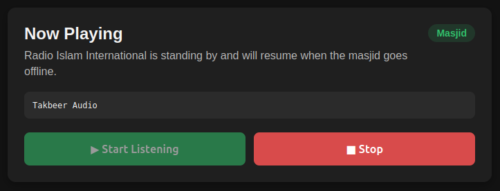

## 4. Masjid tab

### Masjid Power

The Masjid Power switch enables or disables the Listen priority module.

Turning **Masjid Power off**:

- powers Radio off as well;
- stops active playback;
- cancels any pending Radio resume delay; and
- stops the Listen controller completely.

While Masjid Power is off, Listen should report **Stopped**, not Waiting.

Turning Radio on while Masjid is off automatically turns Masjid on first, because Radio is only allowed to operate as the secondary source beneath Masjid priority.

### Selecting a masjid

Use **Search** to filter the masjid catalogue by name or location, then select a masjid from the list.

The **Selected Masjid** summary near the top of the tab identifies the configured primary masjid even while its stream is offline.

Masjid selection is saved immediately. Selecting a masjid does not require it to be online and does not by itself start a stopped Listen controller.

### Favourites

Frequently used masajid can be added to **Favourites** for quicker selection.

Select a masjid and use **Add to Favourites** or **Remove from Favourites**. Favourites are also the only masjids offered by the simplified touch controls on the 7-inch Appliance Display.

### Masjid Volume

Masjid Volume is the software volume used when the masjid source is playing.

Range:

```text
0%–150%
```

Values above 100% apply software amplification. The UI changes the volume indication when boost is active. Boost can cause clipping or distortion on already-loud streams, so use it only when required.

Masjid Volume is independent of Radio Volume.

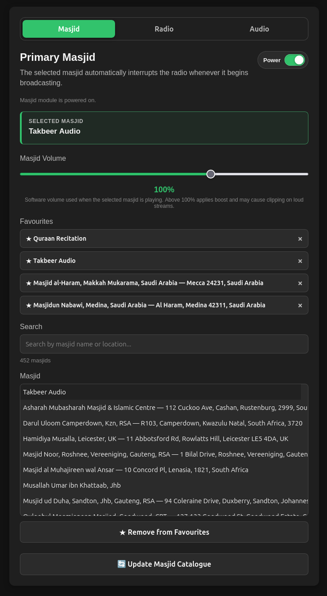

## 5. Radio tab

Radio is optional. If you do not want secondary Radio playback, leave Radio Power off.

### Radio Power

Turning **Radio Power on** enables secondary Radio operation. If Masjid Power is currently off, MasjidPi automatically enables Masjid Power as well and notifies you.

Turning Radio Power off prevents Radio playback but does not disable Masjid playback.

### Selecting a Radio station

Choose a station from the **Radio Station** list. The catalogue contains validated South African Islamic radio streams supported by the current MasjidPi release.

The selected station is saved immediately. Selecting a station changes the configured Radio source but does not necessarily start playback; playback remains governed by the selected Radio operating mode and Masjid priority.

### Radio Volume

Radio Volume is independent of Masjid Volume and uses the same:

```text
0%–150%
```

software-volume range.

Values above 100% are boosted and may cause clipping.

### Radio operating modes

Radio has three explicit operating modes.

#### Play on Schedule

This is normal automatic operation.

Radio plays only when all applicable conditions permit it:

- Masjid Power is on;
- Radio Power is on;
- the selected masjid is offline;
- the post-masjid resume delay has expired; and
- the current time is inside the configured Radio playback window when scheduling is enabled.

#### Play Now

**Play Now** is a temporary manual override.

It starts Radio immediately when the masjid is offline, even if Radio would normally be silent because of quiet time or a post-masjid resume delay.

The override is deliberately temporary. Masjid priority still applies.

For example, if quiet time began at 20:00 and you press Play Now at 20:15, Radio can play immediately. If the masjid subsequently comes online, it interrupts Radio. If the masjid then goes offline while quiet time still applies, Radio remains silent because the masjid event returns Radio to scheduled operation.

Similarly, pressing Play Now immediately after a masjid broadcast can bypass the configured resume delay, but the next relevant event returns Radio to normal scheduled behaviour.

Play Now is not intended to become a permanent configuration state.

#### Stop Radio

**Stop Radio** is persistent manual suppression.

Once selected, Radio remains stopped until you explicitly select either:

- **Play on Schedule**, or
- **Play Now**.

A schedule boundary or masjid broadcast does not automatically cancel Stop Radio.

### Radio Resume Delay

After a masjid broadcast ends, scheduled Radio playback does not need to resume immediately.

The configurable delay is:

```text
1–30 minutes
```

in one-minute increments.

The delay applies to normal scheduled operation. **Play Now** can manually bypass a pending delay.

The transition in the other direction is intentionally different: when the selected masjid comes online, Radio-to-Masjid switching is immediate.

### Daily Radio schedule

Enable **Limit Radio to Daily Times** to define a daily Radio playback window.

For example:

```text
Start: 06:00
Stop:  20:00
```

Radio can then operate automatically during the day while remaining silent overnight.

The schedule affects Radio only. Masjid broadcasts remain available regardless of the Radio quiet-time window.

The schedule may cross midnight. For example, `22:00–02:00` permits Radio during that overnight window.

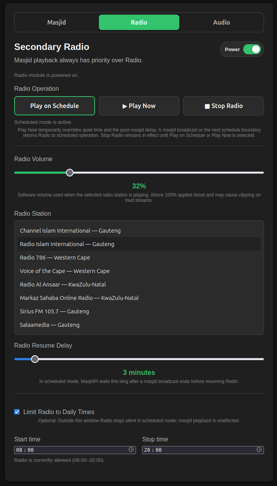

## 6. Audio tab

The Audio tab contains settings for Listen audio output and master hardware volume.

### Audio Output

Choose the ALSA-compatible output device MasjidPi should use for Listen playback.

Available outputs depend on the hardware and operating system.

Use **Refresh Devices** after connecting or disconnecting USB audio hardware. Newly connected outputs appear without restarting MasjidPi. A saved output that is temporarily disconnected remains identified as unavailable and is restored automatically when it returns.

### Master Volume

Master Volume controls the selected audio device's hardware mixer where the device exposes a supported hardware volume control.

This is separate from Masjid Volume and Radio Volume.

Conceptually:

```text
Masjid Volume ─┐
               ├─ software source level ─> Master Volume ─> audio hardware
Radio Volume ──┘
```

Some output devices do not expose a controllable hardware mixer. On those devices, Master Volume may be unavailable. Masjid and Radio software volume controls continue to work.

The selected Audio Output is saved and restored after service restart, appliance reboot and normal release upgrade.

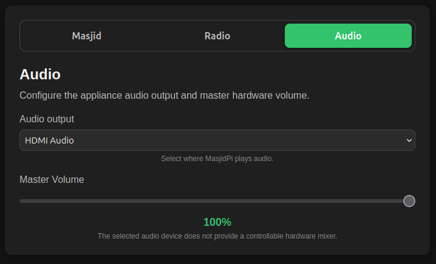

## 7. Common Listen configurations

### Radio during the day, silence at night

1. Turn Masjid Power on.
2. Turn Radio Power on.
3. Select your masjid and Radio station.
4. Select **Play on Schedule**.
5. In Radio, enable **Limit Radio to Daily Times**.
6. Set the desired start and stop times.

### Radio whenever the masjid is offline

1. Turn Masjid and Radio Power on.
2. Select **Play on Schedule**.
3. Disable the daily Radio time limit if you want Radio available all day.
4. Choose the desired post-masjid resume delay.

The masjid will still interrupt Radio immediately whenever it broadcasts.

### Masjid only, never Radio

Leave **Masjid Power on** and turn **Radio Power off**.

### Temporarily listen to Radio during quiet time

With the masjid offline, press **Play Now**.

Masjid priority remains active, and the next relevant event returns Radio to scheduled operation.

### Silence all Listen audio

Turn **Masjid Power off**. Radio is forced off and the Listen controller stops completely.

## 8. Settings, restarts and power failures

MasjidPi persists normal appliance configuration so it can recover sensibly after a service restart or device reboot. Persisted Listen settings include the configured source selections and normal source-volume/settings state.

Module power state and Radio scheduling configuration are designed as appliance settings rather than browser-only state.

**Play Now is intentionally temporary.** Do not rely on it as a permanent post-reboot operating mode; use Play on Schedule and the Radio schedule for normal unattended operation.

## 9. Board

Board is available when the Board component is installed.

### Selecting MasjidBoards

The Board page contains **Masjids**, **Display** and **Status** tabs.

In **Masjids**:

1. Choose up to three locations to define which MasjidBoards are available.
2. Select **Save Locations** after changing the location scope.
3. Search the resulting catalogue and add between one and three MasjidBoards.
4. Arrange the selected MasjidBoards in the required display order.

Selected-Masjid additions, removals and ordering are saved automatically. Location-scope changes require the explicit **Save Locations** action because they rebuild the available catalogue.

Each selected masjid has a **Detailed Jumu’ah schedule** option. It is enabled by default and can be disabled independently for a masjid. When enabled and valid details are supplied upstream, an attributed schedule card joins the notice rotation only during the Islamic Friday interval.

In TV / Monitor mode, the first selected masjid supplies the shared Daily Times information. In the 7-inch Appliance Display, each selected masjid receives its own rotating Salaah Times slide, while shared Daily Times come from the first selected masjid.

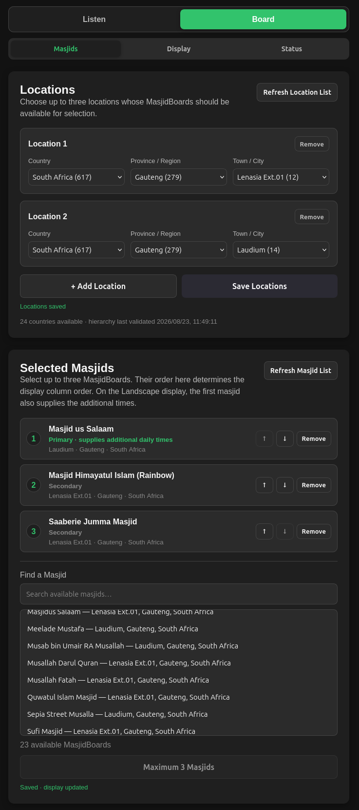

### Layout

MasjidPi supports dedicated HDMI presentation including:

- **TV / Monitor (responsive landscape)**
- **7-inch Appliance Display (600 × 1024)** — purpose-built for the integrated screen in the physical MasjidPi appliance

The presentation adapts to the number of configured masjids.

The local HDMI profile is selected automatically from the attached hardware. It is not a saved layout choice. The **Display** tab configures:

- slide duration from 5 to 60 seconds;
- one of six Board colour themes; and
- optional Islamic Economic Indicators;
- independently enabled Daily Ayah, Daily Hadith and Daily Sunnah cards; and
- the optional Dua-after-Adhan card.

Slide duration, theme and optional-content settings are saved automatically. **Open Display Preview** opens the standard browser presentation, while **Appliance Preview** opens the portrait appliance presentation without changing the physical display.

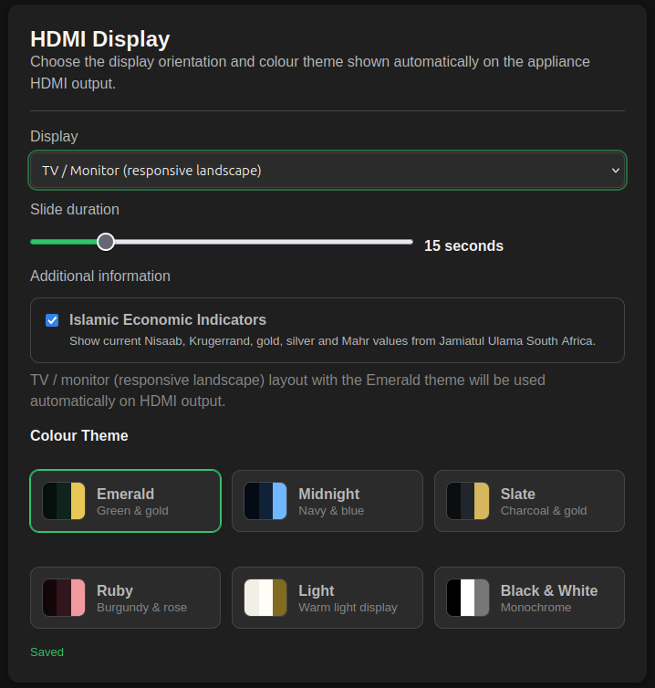

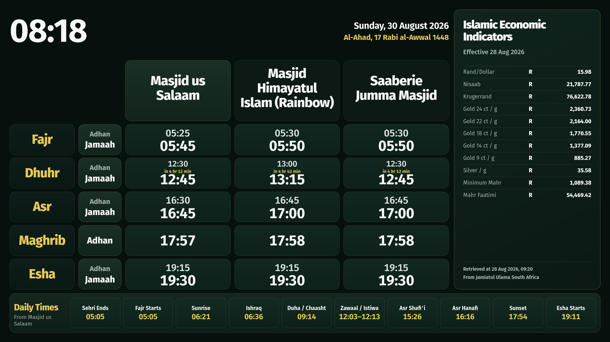

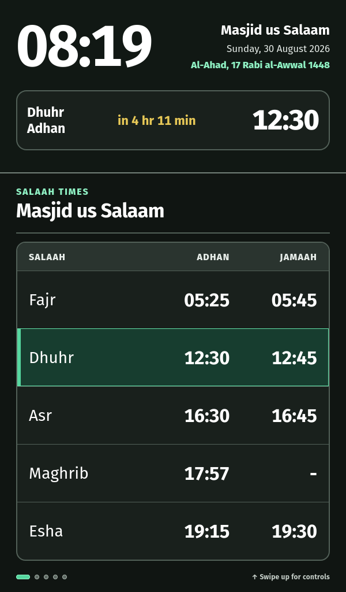

#### 7-inch touch controls

On the 7-inch Appliance Display, swipe up to open the touch control sheet. A small on-screen hint identifies the gesture. Opening the sheet pauses slide rotation; swipe down from its handle/header, tap ×, or tap outside the sheet to close it and resume the slideshow.

The control sheet provides:

- a **Masjid** tab for choosing a favourited masjid, adjusting Masjid and Master volume, starting playback and stopping Listen;
- a **Radio** tab for choosing a station, adjusting Radio and Master volume, and selecting Scheduled Play, Play Now or Stop Radio; and
- a **Theme** tab for immediately applying and saving any supported Board colour theme.

The **Network** tab provides **Change Wi-Fi network**, which reopens the appliance network setup without deleting the current profile first.

Masjids must first be added to Favourites through the full Web UI. Selecting a Masjid or Radio source in the touch panel does not start it until the corresponding playback action is selected.

The panel closes automatically after 60 seconds without user activity. Tapping, scrolling, swiping, using the keyboard or adjusting a control restarts that timer. The time and upcoming-event section remains visible while the panel is open.

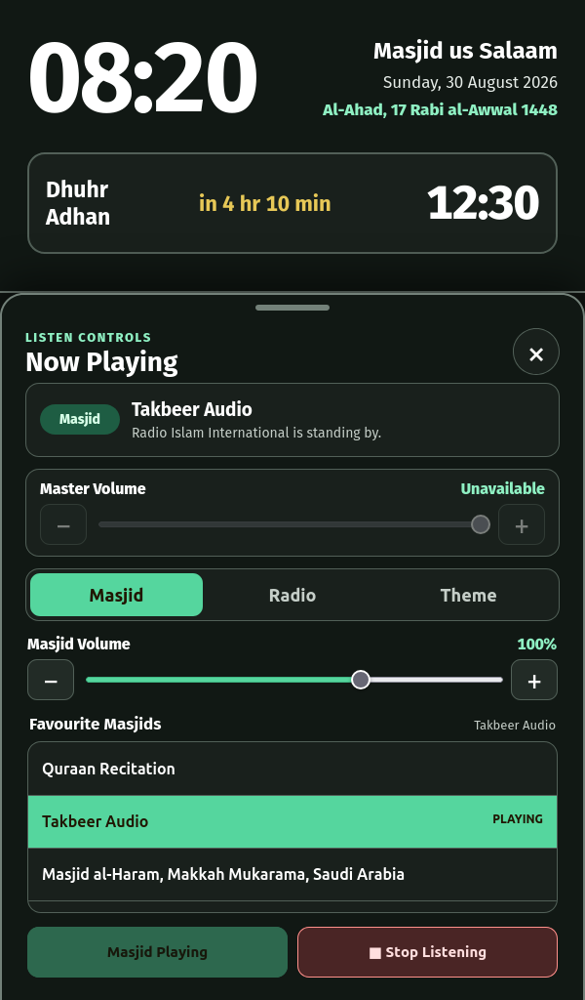

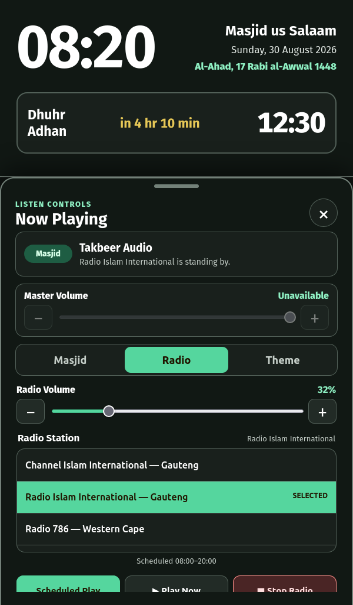

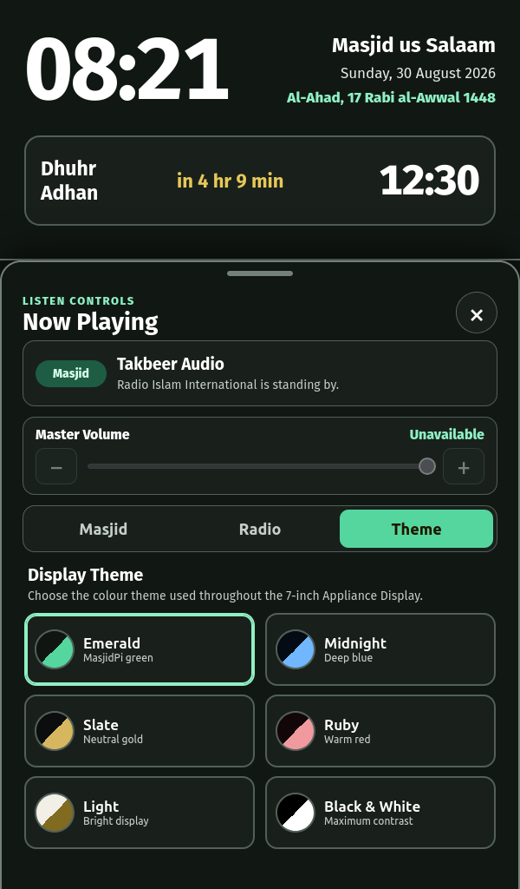

### Themes

Board includes curated colour themes. Theme and display-mode changes can be made from the Web UI without restarting the display service. The 7-inch Appliance Display can also change the saved theme from its touch control sheet.

The Board theme is an appliance setting shared by the HDMI display, browser preview and touch panel. It is separate from the System/Light/Dark theme used by the configuration Web UI.

### Listen source notifications

When Listen switches to a masjid or Radio station, both Board layouts show a notification naming the new source for 10 seconds. A notification is not shown merely because the Board page loaded or reconnected.

While Radio is waiting for the configured post-masjid resume delay, the notification names the selected station, shows the live countdown and remains visible until the waiting state ends. It is then replaced by the Radio-playing notification or cleared if playback is cancelled or superseded.

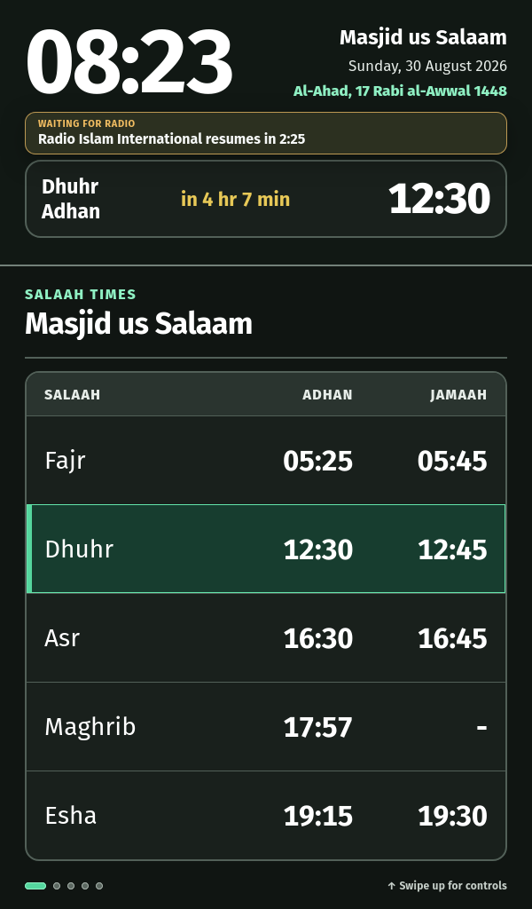

### Display information

Depending on available upstream data, Board can show:

- prayer and Jumu'ah times;
- Daily Times;
- Gregorian and Islamic dates;
- next-event countdowns;
- community announcements, weekly programmes, class-time changes and Ramadan/Taraweeh programmes;
- structured Nikah, funeral, Eid, Taleem, Jamaat, contribution and well-wishes cards;
- detailed Friday-only Jumu’ah schedule cards;
- non-duplicate special-day Dhuhr times in the primary masjid's Daily Times;
- shared Daily Ayah, Daily Hadith and Daily Sunnah cards;
- an optional bilingual Dua after Adhan card; and
- optional Islamic Economic Indicators sourced from Jamiatul Ulama South Africa.

Not every masjid supplies every type of content.

Notice cards identify their upstream masjid with **Source:**. Islamic Economic Indicators retain their own Jamiat attribution and update information.

The **Dua after Adhan** option is under **Board → Display → After Adhan**. It is disabled by default. When enabled, MasjidPi shows its own Arabic-and-English card for five minutes beginning at a listed Adhan time for the primary selected masjid, using that masjid's timezone. During this priority window, the Appliance card remains continuously visible and the Landscape card occupies the complete notice column; ordinary slides or notice cards resume automatically afterward. The card does not show a source attribution because it is built-in MasjidPi content rather than a selected masjid notice.

Community cards are shown one selected masjid at a time and use a consistent priority order. Funeral and urgent/time-sensitive notices appear before general announcements and programmes. Shared Daily Ayah, Hadith, Sunnah and Economic Indicator pages appear after all masjid-specific content.

When the primary masjid publishes an Istiwaa caution/Zawaal interval, the clock and current date flash red throughout that interval. The warning begins at the published caution time (or Istiwaa when no caution time is available) and ends at the published Zawaal end time.

A provider-supplied special Dhuhr time, such as **Dhuhr (Sundays & Public Holidays)**, is always listed in the primary masjid's Daily Times so it can be seen in advance. MasjidPi suppresses it when it is identical to the normal Dhuhr Adhan or Jamaah time.

Arabic and mixed-language notices use automatic text direction. MasjidPi treats upstream notice headings conservatively: only recognised Salaah-change, class-time, weekly-programme and Ramadan/Taraweeh headings receive a specialised label; other text remains a general announcement.

### Board status

The **Status** tab reports each selected MasjidBoard as Current, Stale or Unavailable, together with its most recent update information. Use **Refresh Timetables** to request an immediate refresh.

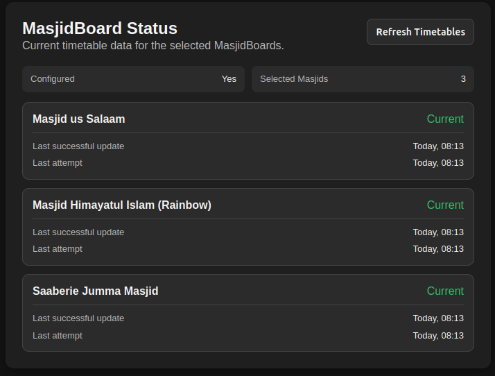

### Upstream outages

MasjidPi maintains last-known-good timetable data so the Board can continue displaying cached information during temporary upstream failures. The status shown in the configuration interface should be used to determine whether current or cached data is being displayed.

## 10. Updating MasjidPi

Normal users should install official releases rather than development branches.

See [INSTALL.md](INSTALL.md) for the supported installation and update procedure.

Release candidates use a version such as:

```text
vX.Y.Z-rc.N
```

These are prerelease builds intended for validation before the corresponding stable release. They may contain known or undiscovered defects and should not replace a validated production installation unless you specifically intend to test the RC.

Normal upgrades preserve MasjidPi's persistent configuration and runtime data.

## 11. Troubleshooting

### Nothing is playing

Check:

1. Is Masjid Power on?
2. Does Now Playing say **Stopped** or **Waiting**?
3. Is the selected masjid currently online?
4. If you expect Radio, is Radio Power on?
5. Is Radio set to Stop Radio?
6. Is the current time outside the Radio schedule?
7. Is a post-masjid resume delay still active?

### The masjid is offline

MasjidPi can only play a masjid when its upstream live stream is available. The Selected Masjid indicator shows which masjid remains configured even while it is offline.

If Radio is enabled and permitted by its operating mode, it can play while the masjid is offline.

### Radio does not resume after the masjid

Check:

- Radio Power;
- Radio operating mode;
- Radio Resume Delay;
- the daily Radio schedule; and
- whether Stop Radio was selected.

Use **Play Now** if you deliberately want to bypass the current delay or quiet-time restriction once.

### Master Volume is unavailable

Some ALSA outputs do not expose a hardware mixer that MasjidPi can control. This does not prevent playback. Use the Masjid and Radio software-volume controls and, where necessary, the volume control provided by the amplifier, television or speakers.

### No audio

Check the selected **Audio Output** in Config and verify the external amplifier, television or speakers are powered and set to the correct input.

For system-level diagnosis:

```bash
sudo systemctl status masjidpi --no-pager
```

and:

```bash
sudo journalctl -u masjidpi --no-pager -n 100
```

Listen controller status can be inspected with:

```bash
curl -s http://127.0.0.1:8080/api/listen/status
```

### Board is not displaying

Check the main service and Board display service:

```bash
sudo systemctl status masjidpi --no-pager
sudo systemctl status masjidpi-display --no-pager
```

Board status is available at:

```bash
curl -s http://127.0.0.1:8080/api/masjidboard/status
```

### Touch controls do not open

The swipe-up controls are available only in **7-inch Appliance Display (600 × 1024)** mode. Confirm that this mode is selected in Board → Display and that the small **Swipe up for controls** hint is visible.

Swipe upward from the lower display area. The panel closes automatically after 60 seconds without activity.

## 12. Further documentation

- [Installation Guide](INSTALL.md)
- [Project README](../README.md)
- [Development Roadmap](../ROADMAP.md)

MasjidPi is an independent project. Live masjid streams and timetable/content data depend on the external services identified in the project README.
